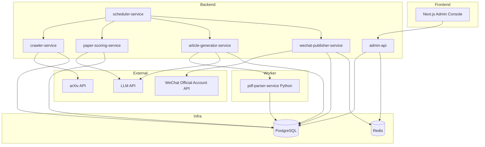

# arXiv 遥感基础大模型论文发现与公众号发布系统设计

## 1. 文档目标

本文档用于定义一个面向“遥感视觉基础大模型/RS Foundation Model”方向的论文发现、筛选、解读、成稿与公众号发布系统。

目标不是做一个泛化网页爬虫，而是建设一个稳定、可审核、可扩展的内容生产流水线：

- 每天自动发现候选论文
- 自动筛选并推荐 1 篇“今日最优”
- 自动生成公众号草稿
- 由运营或研究人员人工审核
- 审核通过后发布到微信公众号

V1 重点是把链路跑通，并保证稳定性、可控性和合规性；不追求完全无人化自动发布。

---

## 2. 产品定位

### 2.1 正确的问题定义

这不是一个“网页爬虫项目”，而是一个“论文内容生产系统”。

更准确的产品定义应为：

> 基于 arXiv 官方 API 获取论文候选，结合 PDF 解析与 LLM 编排能力，自动生成公众号草稿，并通过人工审核后完成发布。

因此，系统的核心不是“抓到多少页面”，而是以下四件事：

- 找到真正相关的论文
- 尽量稳定地理解论文内容
- 生成可发布、可编辑的公众号稿件
- 建立可回溯、可审核、可重试的发布流程

### 2.2 产品边界

V1 明确限制在以下范围内：

- 数据源仅限 arXiv
- 内容对象仅限“遥感/地球观测/卫星/航拍/多模态/基础模型”相关论文
- 输出目标仅限微信公众号草稿与发布链路
- 默认流程为“自动生成 + 人工审核 + 手动发布”

V1 不做：

- 多来源学术站点聚合
- 全自动无人审核直发
- 大规模自动抓取网页正文
- 自动搬运论文图表并对外二次分发
- 多 Agent 自主浏览网页并自行决策发布

### 2.3 核心成功指标

建议用可量化指标定义系统是否成功：

- 每日候选论文抓取成功率 >= 99%
- 每日推荐论文至少 1 篇可用于成稿
- 公众号草稿生成成功率 >= 95%
- 运营人工修改时间控制在 10 到 20 分钟内
- 发布链路可追踪率 100%
- 重复抓取、重复生成、重复发布事故为 0

---

## 3. 总体设计原则

### 3.1 人工审核是 V1 的硬约束

论文理解、版权边界、公众号合规都不适合 V1 直接交给全自动系统。系统应以“提升审核效率”为目标，而不是以“完全替代人”为目标。

### 3.2 Agent 是能力分层，不是自由自治体

文档中提到的 Discovery / Ranking / Reading / Writing / Publishing Agent，更适合被理解为五类职责域，而不是五个任意自主决策的智能体。

在工程上应将其收敛为：

- 有状态任务流
- 可观测的服务边界
- 可配置的 Prompt 和规则
- 明确的人工审批闸门

### 3.3 先保证稳定，再追求智能

优先级应按以下顺序排列：

1. 数据获取稳定
2. 状态流转正确
3. 内容生成可编辑
4. 推荐质量持续提升
5. 自动化程度逐步增强

### 3.4 不长期对外分发原始 PDF 内容

PDF 下载用于内部解析，不建议将 arXiv PDF 重新托管为自有长期公开资源。公众号正文优先使用总结、解读、点评和原文链接。

---

## 4. 业务闭环

系统的业务闭环不是“抓论文”，而是“从论文到内容，再从内容到发布，再从发布结果反哺筛选策略”。

推荐闭环如下：

```mermaid
flowchart LR
    A[定时任务触发] --> B[arXiv 拉取候选论文]
    B --> C[规则过滤与去重]
    C --> D[LLM 重排与评分]
    D --> E[选出今日推荐]
    E --> F[下载 PDF 并解析结构]
    F --> G[生成结构化审稿内容]
    G --> H[生成公众号草稿 HTML]
    H --> I[人工审核与编辑]
    I --> J[发布到公众号]
    J --> K[记录结果与反馈]
    K --> L[优化关键词/评分/Prompt]
```



这个闭环中，真正需要长期优化的是三层：

- 发现层：减少误报、漏报
- 理解层：减少对论文内容的误读
- 写作层：减少人工编辑成本，提高可读性

---

## 5. 优化后的整体逻辑框架

为了避免系统从一开始就设计得过于发散，建议把逻辑框架重构为“4 层 + 1 条状态主线”。

### 5.1 四层结构

#### 第一层：采集与候选池层

负责从 arXiv 拉取论文，并形成当天候选池。

核心职责：

- 按日期窗口抓取近 24 小时新增或更新论文
- 根据关键词和分类做第一轮过滤
- 对论文元数据进行标准化和版本记录
- 处理去重、幂等、重跑

#### 第二层：筛选与推荐层

负责从候选池中选出“最值得写的一篇”。

核心职责：

- 规则打分
- LLM 重排
- 生成评分理由
- 输出 1 篇今日推荐和若干备选

#### 第三层：理解与成稿层

负责把论文转成可审核、可编辑的内容资产。

核心职责：

- 下载 PDF 并解析章节结构
- 抽取摘要、方法、实验、结论、亮点、局限
- 生成结构化审稿 JSON
- 生成公众号 HTML 草稿
- 生成标题、摘要、封面文案、标签

#### 第四层：审核与发布层

负责让自动生成内容变成真正可发布内容。

核心职责：

- 前端审核与编辑
- 草稿管理
- 微信素材上传
- 微信草稿创建与发布
- 发布结果查询与失败重试

### 5.2 一条状态主线

无论系统内部拆多少服务，主链路都必须统一映射到一条明确状态机，否则后期排障会非常困难。

建议的主状态流转：

```text
DISCOVERED
-> FILTERED
-> SCORED
-> RECOMMENDED
-> PDF_DOWNLOADED
-> PARSED
-> CONTENT_GENERATED
-> DRAFT_READY
-> REVIEWING
-> APPROVED
-> PUBLISHING
-> PUBLISHED
```

异常态建议独立管理：

- FILTER_FAILED
- SCORE_FAILED
- PARSE_FAILED
- GENERATE_FAILED
- REVIEW_REJECTED
- PUBLISH_FAILED

每个异常态都应支持：

- 失败原因
- 重试次数
- 最近一次调用请求/响应摘要
- 人工介入备注

---

## 6. 推荐技术方案

## 6.1 技术栈

- 前端：Next.js + Ant Design
- 后端：Go + Gin
- 数据库：PostgreSQL
- 队列/缓存：Redis
- 文档解析与 LLM 生成：独立 Python Worker
- 部署：Docker Compose 起步，后续可迁移 K8s

### 6.2 技术栈选择理由

#### 前端使用 Next.js + Ant Design

适合快速构建内部运营台，组件成熟，表格、表单、抽屉、工作台页面开发效率高。

#### 后端使用 Go + Gin

适合承载 API、任务编排、状态机控制和外部接口整合，部署简单，性能稳定。

#### 文档解析独立为 Python Worker

PDF 解析、版面抽取、自然语言处理、模型调用生态更成熟，更适合与 Go 主服务分层。

#### PostgreSQL + Redis

PostgreSQL 负责核心业务数据、审计日志、状态记录；Redis 负责缓存、短期任务协调、限流和轻量消息队列场景。

---

## 7. 逻辑角色与服务映射

建议把“Agent 职责”映射成更稳定的工程模块。

| Agent 角色 | 工程实现建议 | 核心职责 |
| --- | --- | --- |
| Discovery Agent | `crawler-service` + `scheduler-service` | 从 arXiv 拉取候选论文并入池 |
| Ranking Agent | `paper-scoring-service` | 规则打分、LLM 重排、推荐输出 |
| Reading Agent | `pdf-parser-service` | PDF 下载、章节抽取、结构化解析 |
| Writing Agent | `article-generator-service` | 审稿 JSON、公众号 HTML、标题摘要生成 |
| Publishing Agent | `wechat-publisher-service` | 素材上传、草稿创建、发布、查询状态 |

关键点在于：

- 对外暴露的是服务，不是抽象 Agent
- 所有 Agent 输出都应可落库、可回看、可人工修正
- 每个服务都只做单一职责，避免后期难以替换

---

## 8. 系统架构设计

### 8.1 高层架构



### 8.2 服务划分建议

#### `scheduler-service`

负责：

- 每日定时任务触发
- 补偿任务触发
- 重试任务分发
- 任务超时监控

#### `crawler-service`

负责：

- 调用 arXiv API
- 按日期窗口和关键词拉取候选
- 解析 feed 元数据
- 论文基础信息入库
- 论文版本快照记录

#### `paper-scoring-service`

负责：

- 规则初筛
- 关键词得分
- 类别白名单命中
- 基础模型属性识别
- 调用 LLM 生成重排结果和评分理由

#### `pdf-parser-service`

负责：

- 下载 PDF
- 解析章节标题、正文块、图表标题、参考信息
- 输出结构化内容
- 提供摘要材料给生成服务

#### `article-generator-service`

负责：

- 基于结构化内容生成审稿 JSON
- 生成公众号长文 HTML
- 生成备选标题、导语、摘要、封面文案、标签
- 做风格模板注入

#### `wechat-publisher-service`

负责：

- access_token 获取与缓存
- 素材上传
- 草稿创建
- 发布任务发起
- 发布状态轮询
- 失败原因回写

#### `admin-api`

负责：

- 前端数据接口
- 审核流接口
- 内容编辑保存
- 手动重试
- Prompt 模板管理
- 系统配置管理
- 日志查询与告警视图

---

## 9. 核心业务流程

## 9.1 每日主任务流程

建议每日跑批流程如下：

1. 定时器触发“每日发现任务”
2. 调用 arXiv API 获取近 24 小时候选论文
3. 根据关键词、分类和去重规则入库
4. 对候选论文做规则打分
5. 对 Top N 调用 LLM 做重排
6. 选出 1 篇今日推荐，保留若干备选
7. 下载推荐论文 PDF 并解析结构
8. 生成结构化审稿 JSON
9. 生成公众号 HTML 草稿和运营文案
10. 推送到前端待审核列表
11. 审核人员编辑并确认发布
12. 系统调用微信公众号接口创建草稿并发布
13. 记录发布结果并输出日报

### 9.2 人工审核流程

人工审核是 V1 的关键闸门。

审核页面至少应支持：

- 修改标题
- 修改摘要
- 修改导语
- 删除或重写某一段解释
- 替换封面文案
- 调整标签
- 查看原论文元数据和 arXiv 链接
- 查看评分理由与推荐原因
- 预览最终公众号样式

### 9.3 异常处理流程

任何外部调用失败，都不能直接吞掉。

建议统一异常策略：

- 首次失败：自动重试
- 连续失败：进入失败状态并记录原因
- 达到阈值：进入死信或人工处理队列
- 前端可见：允许手动重试或跳过

外部调用包括：

- arXiv API
- PDF 下载
- LLM 调用
- 微信接口调用

---

## 10. 论文筛选与评分框架

“最优一篇”必须先定义清楚评分规则，否则模型会漂移，最终变成不可控的主观推荐。

建议采用“规则筛选 + LLM 重排”的双层机制。

### 10.1 第一层：规则筛选

先通过确定性规则缩小候选集。

推荐规则包括：

- 标题命中关键词
- 摘要命中关键词
- arXiv 分类命中白名单
- 明显无关方向排除
- 同日重复主题去重

关键词建议分组管理：

- 遥感领域：`remote sensing`、`earth observation`、`satellite`、`aerial`、`geospatial`
- 模态相关：`multimodal`、`vision-language`、`VLM`
- 基础模型相关：`foundation model`、`pretraining`、`generalist`、`large-scale`
- 特殊场景：`SAR`、`multispectral`、`hyperspectral`、`change detection`

### 10.2 第二层：评分与重排

建议总分 100 分：

- 主题相关度：40
- 基础模型属性：25
- 技术新颖性：15
- 落地价值：10
- 证据完整性：10

### 10.3 评分细则建议

#### 主题相关度（40 分）

判断是否真正属于遥感/地球观测/卫星/航拍/多光谱/SAR 等场景，而不是仅借用了“spatial”或“geographic”等模糊词汇。

#### 基础模型属性（25 分）

判断论文是否具有以下特征：

- 通用预训练
- 覆盖多任务
- 面向多模态
- 强调大规模数据
- 明确基础模型或通用模型定位

#### 技术新颖性（15 分）

重点看是否提出了：

- 新架构
- 新数据集
- 新训练策略
- 新任务统一范式

#### 落地价值（10 分）

重点看是否覆盖遥感中高价值任务：

- 分类
- 检测
- 分割
- 变化检测
- 定位
- 检索

#### 证据完整性（10 分）

重点看实验是否充分：

- 是否有系统实验
- 是否有对比基线
- 是否有消融
- 是否开源代码或数据

### 10.4 LLM 输出要求

LLM 不应只输出一个分数，而应输出结构化结果：

```json
{
  "topic_score": 36,
  "foundation_model_score": 20,
  "novelty_score": 12,
  "practicality_score": 8,
  "evidence_score": 9,
  "total_score": 85,
  "recommendation": "high",
  "reasons": [
    "论文明确面向遥感基础模型预训练",
    "覆盖多模态任务并包含较完整实验",
    "与公众号选题方向高度一致"
  ],
  "risks": [
    "实验主要集中在单一数据域",
    "开源承诺未完全兑现"
  ]
}
```

这样做的意义是：

- 便于前端展示评分依据
- 便于后续做质量回溯
- 便于人工审核快速判断

---

## 11. 内容理解与生成框架

系统应同时产出两类内容，而不是只生成一篇文章。

### 11.1 审稿版结构化内容

用于前端审核、质检和再利用，推荐存为 JSON。

建议字段：

- 论文标题
- 作者与机构
- arXiv ID 与链接
- 研究问题
- 方法概述
- 模型结构亮点
- 数据集与任务
- 实验结果摘要
- 亮点
- 局限
- 是否建议发布
- 风险备注

### 11.2 运营版公众号内容

用于最终发布，建议直接生成 HTML。

推荐文章结构：

1. 标题
2. 导语
3. 论文信息卡
4. 为什么值得关注
5. 方法解读
6. 实验与结果解读
7. 亮点与局限
8. 对行业或研究的意义
9. 原文链接与建议阅读人群

### 11.3 写作原则

写作系统必须遵守以下原则：

- 不大段复制原文
- 以总结、解读、点评为主
- 显式区分“论文声称”和“系统判断”
- 对不确定内容保守表达
- 优先让运营人员容易修改，而不是追求一次成稿完美

### 11.4 生成内容清单

每次生成建议输出：

- 3 个备选标题
- 1 个推荐标题
- 1 段摘要
- 1 段导语
- 公众号正文 HTML
- 封面文案
- 推荐标签
- 文章摘要卡片文案

---

## 12. 前端运营台设计

前端重点不是美观，而是审核效率与任务可控。

### 12.1 仪表盘

展示：

- 今日抓取数量
- 规则过滤后数量
- LLM 重排后数量
- 今日推荐数量
- 草稿生成成功数
- 发布成功数
- 失败任务数

### 12.2 论文池

展示：

- 候选论文列表
- 评分明细
- 推荐排序
- 去重状态
- 是否已生成草稿

支持操作：

- 查看详情
- 手动加入候选
- 排除论文
- 手动触发重评分

### 12.3 文章编辑器

左侧建议展示论文与结构化解读，右侧展示公众号预览。

必须支持：

- 标题改写
- 摘要改写
- 段落删改
- 插图占位替换
- 标签修改
- HTML 预览
- 审核意见记录

### 12.4 发布中心

展示：

- 草稿状态
- media_id
- publish_id
- 计划发布时间
- 实际发布时间
- 失败原因
- 重试入口

### 12.5 配置中心

管理：

- 关键词
- 分类白名单
- 评分规则
- Prompt 模板
- 公众号密钥
- 自动发布开关
- 告警策略

### 12.6 日志与告警

展示：

- 每日任务链路
- 每一步耗时
- 外部接口异常
- 重试历史
- 死信任务

---

## 13. 数据库设计建议

以下为核心表建议。

### 13.1 `papers`

存论文主记录。

建议字段：

- `id`
- `arxiv_id`
- `title`
- `authors`
- `abstract`
- `primary_category`
- `categories`
- `published_at`
- `updated_at`
- `pdf_url`
- `source_url`
- `current_status`
- `is_recommended`
- `created_at`
- `updated_at`

### 13.2 `paper_versions`

记录 arXiv 元数据版本变化。

建议字段：

- `id`
- `paper_id`
- `version_no`
- `title`
- `abstract`
- `authors`
- `categories`
- `published_at`
- `source_payload`
- `created_at`

### 13.3 `paper_scores`

记录评分结果。

建议字段：

- `id`
- `paper_id`
- `score_date`
- `topic_score`
- `foundation_model_score`
- `novelty_score`
- `practicality_score`
- `evidence_score`
- `total_score`
- `score_reasons`
- `risk_notes`
- `model_name`
- `prompt_version`
- `created_at`

### 13.4 `paper_contents`

记录解析与理解结果。

建议字段：

- `id`
- `paper_id`
- `parse_status`
- `pdf_local_path`
- `parsed_sections`
- `figure_captions`
- `terminology`
- `review_json`
- `raw_parser_output`
- `created_at`
- `updated_at`

### 13.5 `article_drafts`

记录公众号草稿与人工编辑结果。

建议字段：

- `id`
- `paper_id`
- `title`
- `summary`
- `html_content`
- `cover_text`
- `tags`
- `review_status`
- `reviewer_id`
- `review_comment`
- `approved_at`
- `created_at`
- `updated_at`

### 13.6 `publish_jobs`

记录发布任务。

建议字段：

- `id`
- `draft_id`
- `draft_media_id`
- `publish_id`
- `publish_status`
- `publish_response`
- `retry_count`
- `failed_reason`
- `published_at`
- `created_at`
- `updated_at`

### 13.7 `prompt_templates`

管理 Prompt 与风格模板。

建议字段：

- `id`
- `template_type`
- `template_name`
- `template_content`
- `version`
- `is_active`
- `created_at`
- `updated_at`

### 13.8 `system_configs`

管理系统配置。

建议字段：

- `id`
- `config_key`
- `config_value`
- `description`
- `updated_at`

### 13.9 `task_runs`

记录任务运行情况。

建议字段：

- `id`
- `task_type`
- `biz_date`
- `status`
- `trigger_source`
- `started_at`
- `ended_at`
- `duration_ms`
- `result_summary`
- `error_message`
- `created_at`

---

## 14. 任务编排与幂等设计

系统一旦进入自动化链路，幂等是基础能力，不是附加能力。

### 14.1 幂等要求

- 同一 `arxiv_id` 同一版本不能重复入库
- 同一论文同一天不能重复生成多个“默认草稿”
- 同一草稿不能重复提交发布
- 同一发布任务重复轮询不能生成重复状态记录

### 14.2 推荐幂等键

- 抓取：`source + arxiv_id + version_no`
- 评分：`paper_id + score_date + prompt_version`
- 内容生成：`paper_id + draft_template_version`
- 发布：`draft_id + publish_channel`

### 14.3 重跑策略

支持以下维度重跑：

- 重抓某日任务
- 重评某篇论文
- 重解析某篇 PDF
- 重生成某篇文章
- 重发某个发布任务

---

## 15. 外部接口与合规约束

### 15.1 arXiv 使用约束

建议遵循以下原则：

- 优先使用官方 API
- 控制调用频率，避免高频抓取
- 使用单连接和合理时间窗口
- 不做超范围下载

工程上建议：

- 拉取 API 时控制到 3 秒 1 次以内
- 设置统一 User-Agent
- 对失败请求做指数退避

### 15.2 微信公众号接口约束

注意以下问题：

- `access_token` 要缓存
- `AppSecret` 必须加密存储
- 图片和正文素材要区分处理
- 发布结果不能只看接口提交成功，还要查最终状态

每次发布至少记录：

- `draft_media_id`
- `publish_id`
- 微信返回码
- 微信返回消息
- 失败原因

### 15.3 内容合规原则

- 不直接复制长段论文原文
- 不对未证实结论做夸大表述
- 显式保留原文链接
- 人工审核后再发

---

## 16. 可观测性与运维要求

### 16.1 日志要求

每个服务至少记录：

- 请求入口日志
- 外部调用摘要
- 任务状态变更日志
- 错误日志
- 重试日志

### 16.2 指标建议

- 每日抓取数
- 候选过滤率
- Top N 推荐命中率
- PDF 解析成功率
- 草稿生成成功率
- 平均审核耗时
- 发布成功率
- 各步骤平均耗时

### 16.3 告警建议

告警触发条件可包括：

- 每日任务未执行
- 候选论文数为 0
- 今日推荐为空
- 微信发布失败
- 连续多次 LLM 调用失败
- 某服务错误率超过阈值

---

## 17. 安全设计

### 17.1 密钥管理

以下信息不得明文散落在代码中：

- 微信 `AppSecret`
- LLM API Key
- 数据库连接串
- Redis 密码

建议：

- 使用环境变量或密钥管理服务
- 数据库存储敏感配置时进行加密
- 前端永不直连微信或 LLM 秘钥

### 17.2 权限控制

后台至少区分：

- 管理员
- 审核员
- 运营编辑
- 只读访客

### 17.3 审计要求

以下动作应有审计记录：

- 修改 Prompt 模板
- 修改评分规则
- 审核通过/驳回
- 发布动作
- 手动重试

---

## 18. 版本规划

### 18.1 V1 范围

V1 只做：

- 每日自动抓取 arXiv
- 自动筛选最优 1 篇
- 自动解析与生成公众号草稿
- 人工审核后发布
- 基础日志、失败重试、后台编辑

### 18.2 V1 不做

- 多数据源聚合
- 自动抓取网页新闻解读
- 自动直发
- 图表自动抽取后直接商用发布
- 复杂的自主式多 Agent 浏览

### 18.3 V2 可扩展方向

- 多来源论文平台接入
- 历史论文专题策划
- 自动生成周报/月报
- 高置信度自动发布
- 用户反馈反哺推荐模型
- 多账号、多栏目管理

---

## 19. 开发里程碑建议

### 第 1 周：产品定义与 PoC

- 锁定数据源为 arXiv
- 确定关键词、分类白名单与文章模板
- 验证候选量、误报率、微信接口可用性

### 第 2 周：基础设施

- 初始化 Go API、PostgreSQL、Redis
- 建立核心表
- 建立任务状态机和鉴权
- 接入调度框架

### 第 3 周：发现与筛选

- 完成 arXiv 拉取
- 完成规则过滤与去重
- 完成 LLM 重排
- 产出每日推荐与备选列表

### 第 4 周：解析与生成

- 完成 PDF 下载和解析
- 生成审稿 JSON
- 生成公众号 HTML 草稿
- 生成标题、摘要和标签

### 第 5 周：发布链路

- 接入素材上传
- 接入微信草稿创建
- 接入发布和状态查询
- 完成失败重试与回写

### 第 6 周：前端运营台

- 完成论文池
- 完成编辑器
- 完成发布中心
- 完成配置中心和日志页

### 第 7 周：测试与灰度上线

- 单元测试：打分、去重、状态机、重试
- 集成测试：抓取到发布全链路
- 灰度上线：先只出草稿，不自动发
- 连续观察 7 天后再评估自动化范围

---

## 20. 落地建议总结

这套系统的正确落地方向，不是“做一个会自己找论文并自动发文的智能体”，而是“做一个稳定的论文内容生产工作流平台”。

最关键的优化点有四个：

- 把 Agent 还原成可控的服务职责
- 把每日任务收敛成一条可回溯状态机
- 把 LLM 输出限制为结构化中间结果 + 可编辑草稿
- 把人工审核保留为 V1 的硬闸门

如果这个边界守住，系统可以先稳定地产出“每天 1 篇高质量公众号草稿”，后续再逐步提高推荐质量和自动化程度。

---

## 21. 参考资料

- arXiv API 官方说明：https://info.arxiv.org/help/api/index.html
- arXiv API Basics：https://info.arxiv.org/help/api/basics.html
- arXiv API User Manual：https://info.arxiv.org/help/api/user-manual.html
- arXiv API Terms of Use：https://info.arxiv.org/help/api/tou.html
- 微信公众号发布链路社区说明：https://docs.hlxuan.top/officialAccount/publish.html
- 微信草稿接口 Go SDK 文档：https://pkg.go.dev/github.com/fastwego/offiaccount/apis/draft

---

## 22. 下一步建议

基于本文档，下一步最值得继续细化的四项内容是：

1. 系统架构图的模块级细化版
2. PostgreSQL 表结构 SQL 初稿
3. 后端 API 设计
4. 项目目录结构与服务拆分方案

